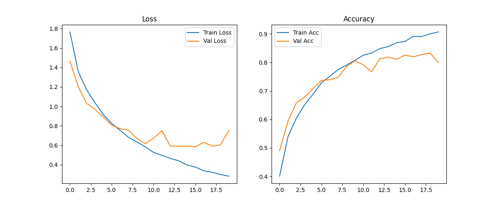
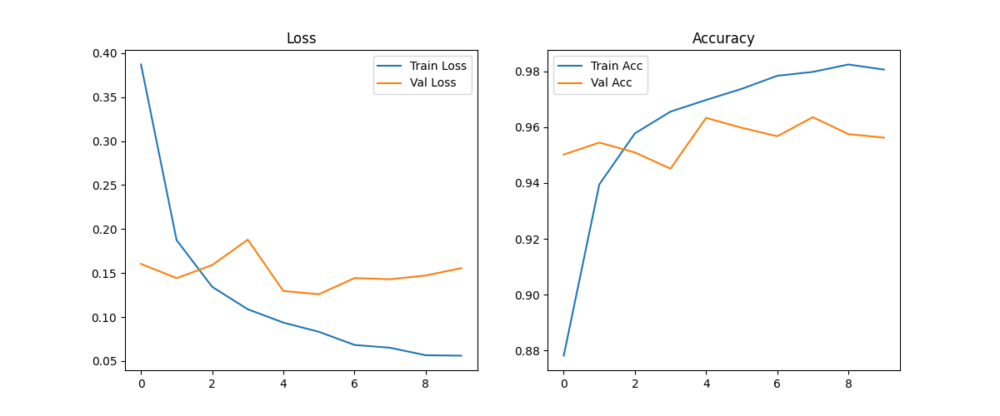
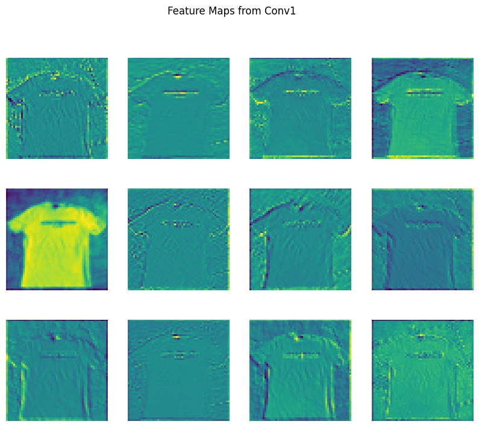
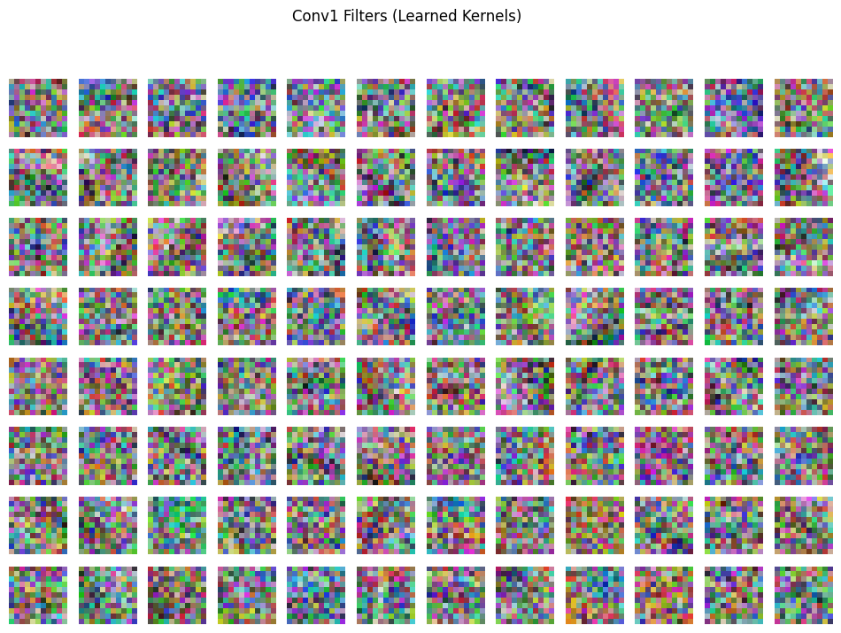

# Garbage Classifier ♻️ (AlexNet & ResNet-50 Pretrained)

   

**Live Demo:** [Streamlit App](https://garbage-classifier-kce7467ekuxbs6nxzs9moa.streamlit.app/)

This repository contains a **Garbage Classifier** built using both **AlexNet (from scratch)** and **ResNet-50 (pretrained)**, trained to classify **10 types of garbage**:

`metal, biological, trash, glass, paper, clothes, cardboard, shoes, battery, plastic`.

---

## 📁 Folder Structure

```
root/
├── deployment/          # Streamlit app
│   └── app.py
├── models/              # Model definition
│   └── model.py
├── results/             # Training results and visualizations
│   ├── loss_accuracy_curve_alexnet.png
│   ├── loss_accuracy_curve_resnet.png
│   ├── filters_alexnet.png
│   └── featuremap_alexnet.png
├── notebooks/           # Jupyter notebook for training/analysis
│   └── garbageClassifier.ipynb
├── README.md            # This file
└── requirements.txt     # Python dependencies
```

---

## 📒 Dataset

The models were trained on a garbage dataset containing labeled images of the 10 classes above. All images were resized to **224×224 pixels** and normalized using standard ImageNet statistics.

---

## 🧠 Model Architectures

### AlexNet (from scratch)

* 5 convolutional layers (`Conv1` → `Conv5`) with ReLU activations
* MaxPooling layers after some convolution layers
* Adaptive average pooling for fixed-size feature maps
* Fully connected layers with dropout to prevent overfitting

> Training from scratch gave competitive results. Pretrained AlexNet can slightly improve convergence but is optional.

### ResNet-50 (Pretrained)

* Pretrained on ImageNet
* Last conv block (`layer4`) and fully connected layer trained/fine-tuned on garbage dataset
* Achieved significantly higher validation accuracy faster than AlexNet
* Residual connections mitigate vanishing gradient problem, allowing deeper network to learn more meaningful features
* Pretrained weights provide strong feature extraction for RGB images, making learning on the garbage dataset efficient

---

## ⚙️ Training Details

* **Input:** 224×224×3 images
* **Loss function:** CrossEntropyLoss
* **Optimizer:** Adam / SGD
* **Epochs:** 20 (AlexNet), 10 (ResNet-50, best model at epoch 8)

### 📊 AlexNet Training Log Highlights

```
Epoch [1/20] | Train Loss: 1.7657, Train Acc: 0.4007 | Val Loss: 1.4651, Val Acc: 0.4901  Best model saved!
Epoch [2/20] | Train Loss: 1.3542, Train Acc: 0.5394 | Val Loss: 1.1996, Val Acc: 0.5938  Best model saved!
Epoch [3/20] | Train Loss: 1.1700, Train Acc: 0.6038 | Val Loss: 1.0305, Val Acc: 0.6580  Best model saved!
Epoch [4/20] | Train Loss: 1.0365, Train Acc: 0.6518 | Val Loss: 0.9692, Val Acc: 0.6787  Best model saved!
Epoch [5/20] | Train Loss: 0.9149, Train Acc: 0.6886 | Val Loss: 0.8900, Val Acc: 0.7075  Best model saved!
Epoch [6/20] | Train Loss: 0.8241, Train Acc: 0.7282 | Val Loss: 0.8063, Val Acc: 0.7366  Best model saved!
Epoch [7/20] | Train Loss: 0.7537, Train Acc: 0.7510 | Val Loss: 0.7709, Val Acc: 0.7394  Best model saved!
Epoch [8/20] | Train Loss: 0.6826, Train Acc: 0.7750 | Val Loss: 0.7546, Val Acc: 0.7480  Best model saved!
Epoch [9/20] | Train Loss: 0.6344, Train Acc: 0.7905 | Val Loss: 0.6716, Val Acc: 0.7854  Best model saved!
Epoch [10/20] | Train Loss: 0.5849, Train Acc: 0.8071 | Val Loss: 0.6150, Val Acc: 0.8056  Best model saved!
Epoch [11/20] | Train Loss: 0.5261, Train Acc: 0.8252 | Val Loss: 0.6720, Val Acc: 0.7917
Epoch [12/20] | Train Loss: 0.4967, Train Acc: 0.8327 | Val Loss: 0.7498, Val Acc: 0.7672
Epoch [13/20] | Train Loss: 0.4640, Train Acc: 0.8485 | Val Loss: 0.5921, Val Acc: 0.8127  Best model saved!
Epoch [14/20] | Train Loss: 0.4407, Train Acc: 0.8555 | Val Loss: 0.5890, Val Acc: 0.8185  Best model saved!
Epoch [15/20] | Train Loss: 0.3968, Train Acc: 0.8691 | Val Loss: 0.5910, Val Acc: 0.8109
Epoch [16/20] | Train Loss: 0.3759, Train Acc: 0.8738 | Val Loss: 0.5853, Val Acc: 0.8256  Best model saved!
Epoch [17/20] | Train Loss: 0.3371, Train Acc: 0.8914 | Val Loss: 0.6301, Val Acc: 0.8195
Epoch [18/20] | Train Loss: 0.3223, Train Acc: 0.8911 | Val Loss: 0.5899, Val Acc: 0.8276  Best model saved!
Epoch [19/20] | Train Loss: 0.2986, Train Acc: 0.9002 | Val Loss: 0.6037, Val Acc: 0.8327  Best model saved!
Epoch [20/20] | Train Loss: 0.2821, Train Acc: 0.9069 | Val Loss: 0.7509, Val Acc: 0.7995
```

### 📊 ResNet-50 Training Log Highlights

| Epoch | Train Loss | Train Acc | Val Loss | Val Acc | Best Model Saved |
| ----- | ---------- | --------- | -------- | ------- | ---------------- |
| 1     | 0.3871     | 0.8781    | 0.1604   | 0.9502  | ✅                |
| 2     | 0.1874     | 0.9395    | 0.1443   | 0.9545  | ✅                |
| 3     | 0.1343     | 0.9578    | 0.1591   | 0.9510  | ❌                |
| 4     | 0.1089     | 0.9656    | 0.1880   | 0.9451  | ❌                |
| 5     | 0.0937     | 0.9698    | 0.1296   | 0.9633  | ✅                |
| 6     | 0.0832     | 0.9737    | 0.1260   | 0.9598  | ❌                |
| 7     | 0.0683     | 0.9784    | 0.1443   | 0.9568  | ❌                |
| 8     | 0.0651     | 0.9798    | 0.1430   | 0.9636  | ✅                |
| 9     | 0.0566     | 0.9825    | 0.1472   | 0.9575  | ❌                |
| 10    | 0.0561     | 0.9806    | 0.1556   | 0.9563  | ❌                |

> **Observation:** Best ResNet-50 model achieved **96.36% validation accuracy** at epoch 8.

---

## 📊 Results

### Loss and Accuracy Curves

**AlexNet:**


**ResNet-50:**


### Learned Filters & Feature Maps (AlexNet Only)

**AlexNet Conv1 Feature Maps:**


**AlexNet Conv1 Filters:**


> These visualizations confirm that AlexNet is learning meaningful low-level features like edges and textures. ResNet-50 benefits from pretrained features and residual connections, explaining its superior performance.

---

## 🚀 Usage

### Streamlit App

* **Deployment:** `deployment/app.py`
* **Features:**
  * Upload image for prediction
  * Dropdown to select **ResNet-50 (pretrained)** or **AlexNet**
  * Shows detected garbage class or “I don’t know” if uncertain

```bash
pip install -r requirements.txt
streamlit run deployment/app.py
```

### Notebooks

* `notebooks/garbageClassifier.ipynb` contains:
  * Data preprocessing
  * Training loops with logs
  * Visualization of filters and feature maps (AlexNet only)
  * Model saving/loading instructions

---

## 🗑️ Observations

* AlexNet from scratch performs reasonably well.
* ResNet-50 pretrained provides **higher accuracy, faster convergence, and better feature extraction** due to residual connections and pretrained weights.
* Using 224×224 images is sufficient for capturing patterns.
* Visualizations confirm meaningful features learned.
* ResNet-50 best model saved at **epoch 8** (val acc 96.36%).

---

## 🔗 References

* [AlexNet Paper](https://papers.nips.cc/paper/2012/file/c399862d3b9d6b76c8436e924a68c45b-Paper.pdf)
* [ResNet Paper](https://arxiv.org/abs/1512.03385)
* [PyTorch Documentation](https://pytorch.org/docs/stable/index.html)
* [Streamlit Documentation](https://docs.streamlit.io)
