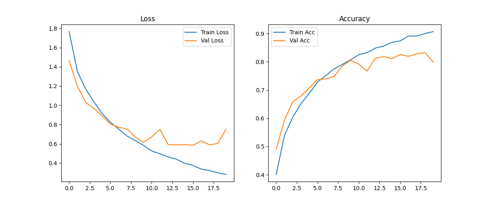
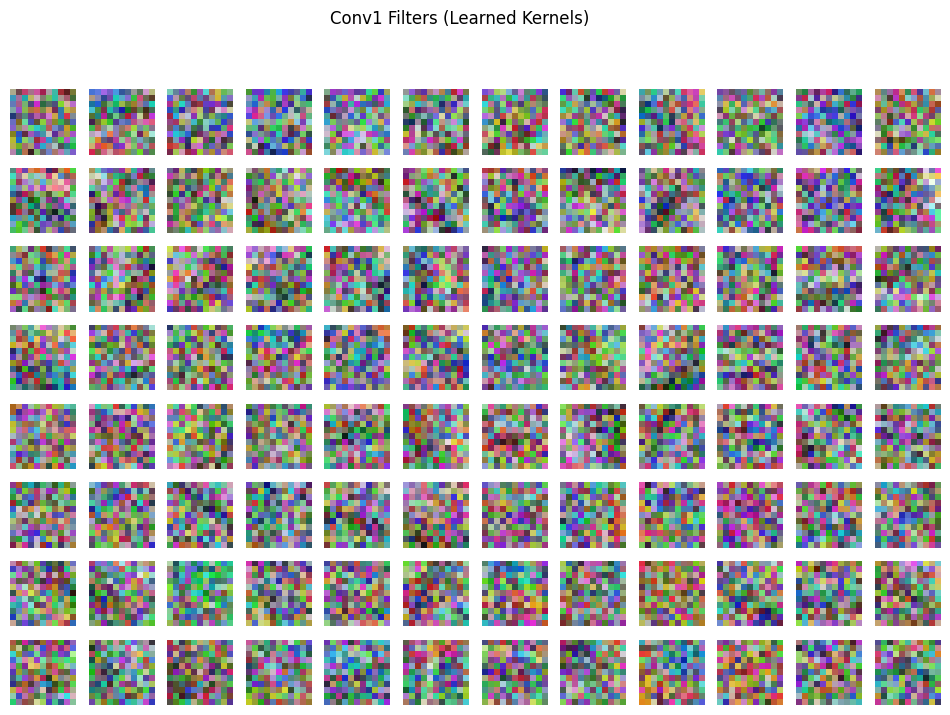
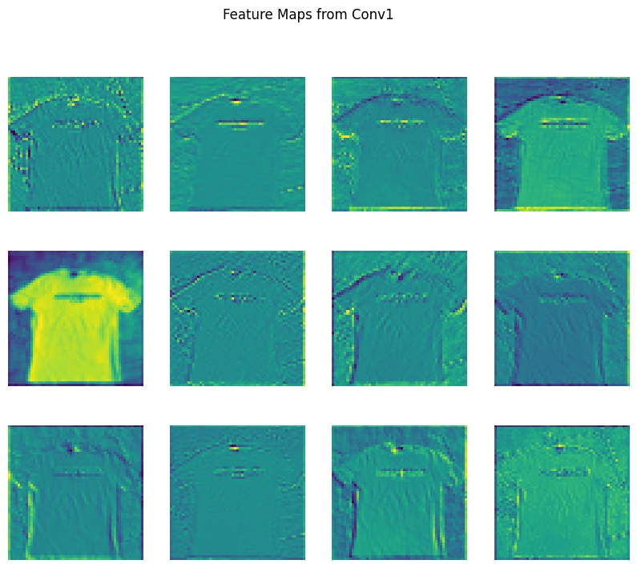

# Garbage Classifier using AlexNet ♻️

   

This repository contains a **Garbage Classifier** built from scratch using **AlexNet**, trained to classify **10 types of garbage**:

`metal, battery, cardboard, glass, trash, clothes, paper, shoes, biological, plastic`.

---

## 📁 Folder Structure

```
root/
├── deployment/          # Streamlit app
│   └── app.py
├── models/              # Model definition
│   └── model.py
├── results/             # Training results and visualizations
│   ├── loss_accuracy_curve.png
│   ├── filters.png
│   └── featuremap.png
├── notebooks/           # Jupyter notebook for training/analysis
│   └── garbageClassifier.ipynb
├── README.md            # This file
└── requirements.txt     # Python dependencies
```

---

## 🗂 Dataset

The model was trained on a garbage dataset containing labeled images of the 10 classes above. All images were resized to **224×224 pixels** and normalized using standard ImageNet statistics.

---

## 🧠 Model Architecture: AlexNet (from scratch)

* 5 convolutional layers (`Conv1` → `Conv5`) with ReLU activations
* MaxPooling layers after some convolution layers
* Adaptive average pooling for fixed-size feature maps
* Fully connected layers with dropout to prevent overfitting

> Training from scratch gave competitive results. Pretrained AlexNet can slightly improve convergence but is not required.

---

## ⚙️ Training Details

* **Input:** 224×224×3 images
* **Loss function:** CrossEntropyLoss
* **Optimizer:** Adam / SGD
* **Epochs:** 20
* **Best model:** Saved at **Epoch 19**

### 📊 Training Log Highlights

| Epoch | Train Loss | Train Acc | Val Loss | Val Acc | Best Model Saved |
| ----- | ---------- | --------- | -------- | ------- | ---------------- |
| 1     | 1.7657     | 0.4007    | 1.4651   | 0.4901  | ✅                |
| 5     | 0.9149     | 0.6886    | 0.8900   | 0.7075  | ✅                |
| 10    | 0.5849     | 0.8071    | 0.6150   | 0.8056  | ✅                |
| 15    | 0.3968     | 0.8691    | 0.5910   | 0.8109  | ❌                |
| 19    | 0.2986     | 0.9002    | 0.6037   | 0.8327  | ✅                |
| 20    | 0.2821     | 0.9069    | 0.7509   | 0.7995  | ❌                |

> **Observation:** Best model achieved **83.27% validation accuracy** at epoch 19.

---

## 📈 Results

### Loss and Accuracy Curve



### Learned Filters (Conv1)



### Feature Maps (Conv1)



> These visualizations confirm that the model is learning meaningful low-level features like edges, textures, and patterns.

---

## 🚀 Usage

### Streamlit App

* **Deployment:** `deployment/app.py`
* **Features:**

  * Upload image for prediction
  * Live webcam predictions
  * Shows detected garbage class or “I don’t know” if uncertain

```bash
pip install -r requirements.txt
streamlit run deployment/app.py
```

### Notebooks

* `notebooks/garbageClassifier.ipynb` contains:

  * Data preprocessing
  * Training loop with logs
  * Visualization of filters and feature maps
  * Model saving/loading instructions

---

## 📝 Observations

* AlexNet from scratch performs well on this dataset.
* Using 224×224 images is sufficient for capturing patterns.
* Slightly more epochs may improve accuracy, but best model was at epoch 19.
* Visualizations confirm meaningful features learned.

---

## 🔗 References

* [AlexNet Paper](https://papers.nips.cc/paper/2012/file/c399862d3b9d6b76c8436e924a68c45b-Paper.pdf)
* [PyTorch Documentation](https://pytorch.org/docs/stable/index.html)
* [Streamlit Documentation](https://docs.streamlit.io)
